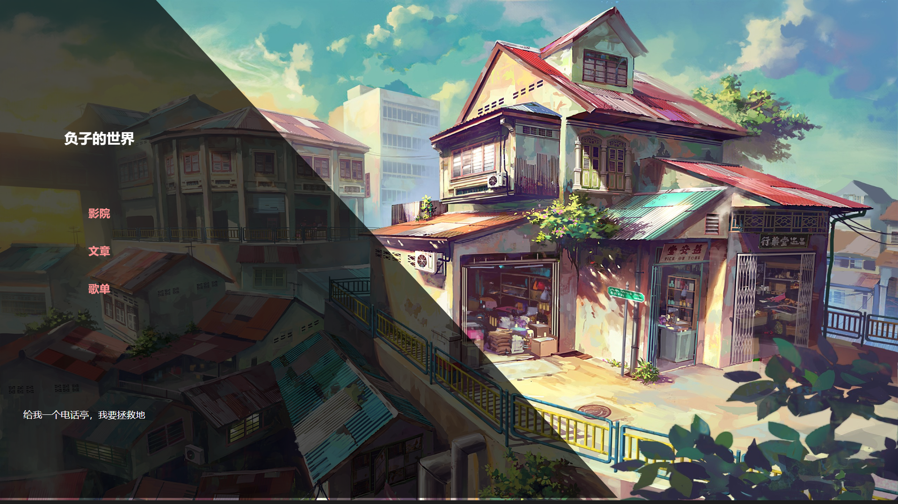
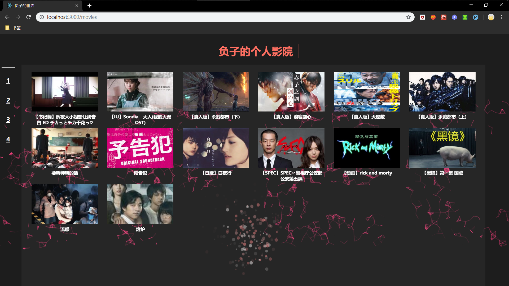
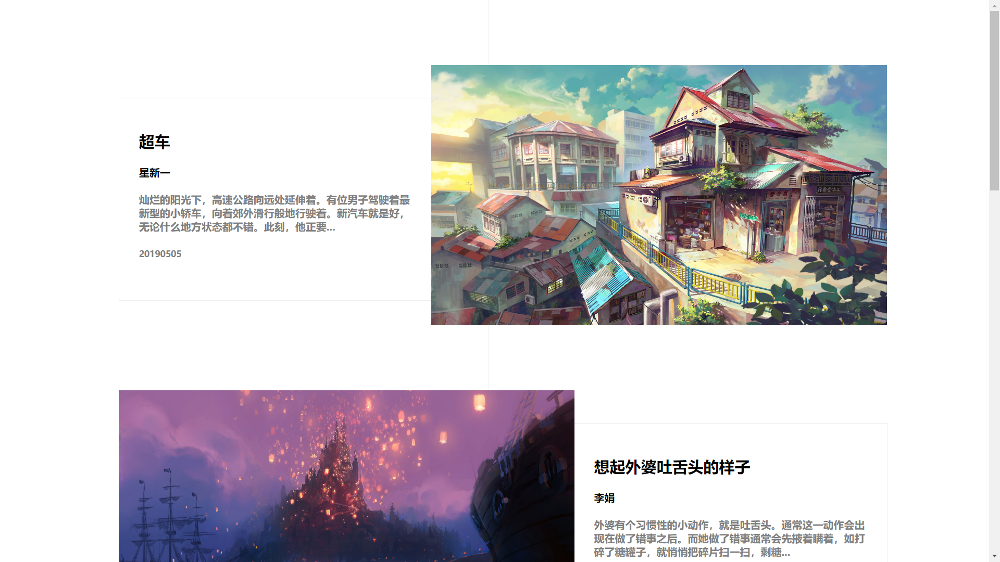
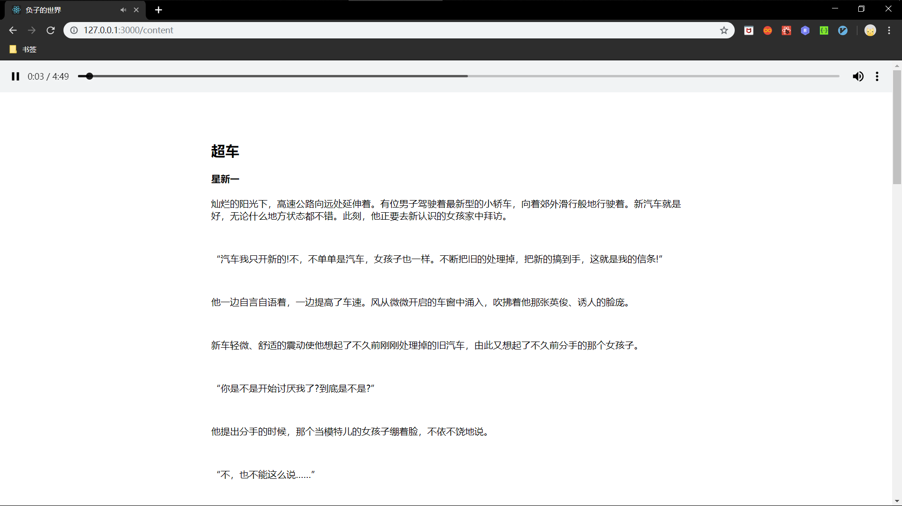
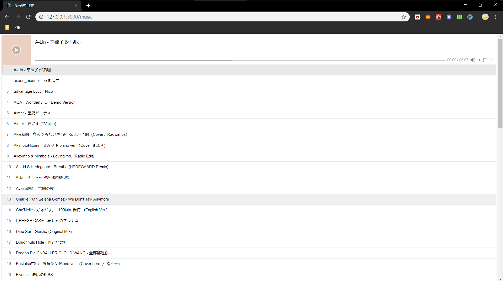

# 负子的世界开发文档

## 一.概述

该项目属于个人学习开发项目，学习网络资源存储和网络API的应用。

## 二.开发环境

React（16.8.6）+Fetch+animate.css+APlayer+PHP（7.3.1）+Slim（3）+Xampp（3.2.2）+OOS对象存储服务

## 三.UI设计

### 1.首页



### 2.影院页面



### 3.文章页面






### 4.歌单页面



## 四.主要技术

### 1.React

https://reactjs.org/

### 2.Fetch

```javascript
fetch("http://127.0.0.1:8000/solvemovies/", {
      method: "GET",
      headers: {
        "Content-Type": "application/json"
      },
      mode: "cors"
    })
      .then(response => response.json())
      .then(data => {})
      .then(response => response, error => error);
```

### 3.OOS

```php
function oosget($object){
    $accessKeyId = "**************";
    $accessKeySecret = "******************";
// Endpoint以杭州为例，其它Region请按实际情况填写。
    $endpoint = "http://oss-cn-hangzhou.aliyuncs.com";
    $bucket= "********";
    //$securityToken = "<yourSecurityToken>";

// 设置URL的有效期为3600秒。
    $timeout = 3600;
    try {
        $ossClient = new OssClient($accessKeyId, $accessKeySecret, $endpoint);

        // 生成GetObject的签名URL。
        $signedUrl = $ossClient->signUrl($bucket, $object, $timeout);
        return $signedUrl;
    } catch (OssException $e) {
        printf(__FUNCTION__ . ": FAILED\n");
        printf($e->getMessage() . "\n");
        return;
    }
}
```

### 4.API

Hitokoto-一言	url：https://v1.hitokoto.cn/?c=f&encode=text

每日一文	url：https://interface.meiriyiwen.com/article/today?dev=1

特定某天一文	url：<https://interface.meiriyiwen.com/article/day?dev=1&date=> + 日期

url 示例：[`https://interface.meiriyiwen.com/article/day?dev=1&date=20170216`](https://interface.meiriyiwen.com/article/day?dev=1&date=20170216)

### 5.APlayer

https://aplayer.js.org/#/

https://aplayer.js.org/#/home

## 五.总结

通过此项目学习网络资源存储和API的应用，对Fetch、Http有更深入的了解，明白了请求的用法与应用。

进一步熟悉ReactJs......

